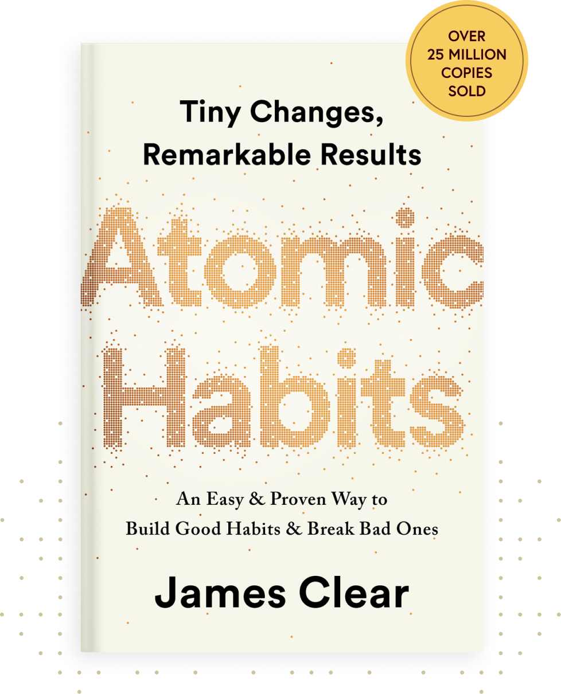
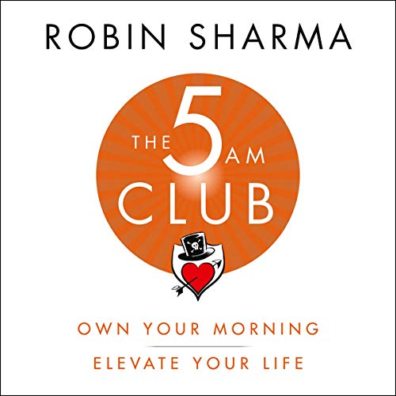

# Week 01 — Success Mindset (Mindset OS)

Part of the DevOps Micro Internship (DMI) Cohort 3 with Agentic AI

---

## Purpose (Read This First)

This week is not motivation homework.

This is you building your **Mindset OS** — the system you will use for the next 5 months (and honestly, for years).

### Expectations

* Be honest.
* Be specific.
* Be practical.
* Write like an adult professional: clear sentences, no one-liners.

You will reuse this in later weeks. So do it properly once.

---

# Assignment 1. What is something you believe to be true that most people around you would disagree with?

### Rules

* No "safe" answers.
* Must be your real belief (not copied from internet).
* Minimum 50 words.

**Hint:** What do you believe about career, money, learning, discipline, relationships, health, success, life, tech industry, etc. that most people don't agree with?

## Answer
Most people believe you need to follow one path to suceed, Pick a lane and stay in it. But i believe most valuable professionals of the future will be the ones who refuse to stay in one lane. Being a Virtual Assistant who is also a devops engineer is not confusion, it is strategy.The word does not reward speacialist alone anymore. It rewards people who can connect skills others never thought to combine

---

# Assignment 2. What are the top 3 objective truths you discovered through experimentation and results?

### Definition

Objective truths do not depend on opinions. They hold true regardless of how people feel.

Write each truth in this format:

**Truth:** (1 sentence)

**Evidence from my life:** (2–4 lines: what you tried + what happened)

---

## Truth #1

### Truth

Waiting until you feel ready will cost you more than starting imperfect ever will...

### Evidence from my life

I registered for cohort 2 and disappeared before it started because i didn't feel qualified enough. Six months later i watched others grow while i stayed stuck. When I finally registered for Cohort 3 and showed up anyway, I realized the fear never goes away. You just have to move despite it.

---

## Truth #2

### Truth
Consistency in public builds credibility faster than private preparation 

### Evidence from my life

I spent months improving my skills quietly but got no recognition or opportunities. The moment I started posting on linkedin about my journey people started to notice me and engage with my work

---

## Truth #3

### Truth

Your background is not a limitation, It is your differentiator.

### Evidence from my life

As a Virtual Assistant when i upskilled into devops i felt out of place among engineers, But my admin experience actually gives me an edge in understanding operations, communication and workflow that purely technical people often lack
---

# Assignment 3. What does your 2.0 version look like?

### Instructions

Write as if a journalist is writing about you **3 to 7 years from now** (not 20 years).

**Minimum 300 words.**
Onyemaechi Blessing Brenda was a Virtual Assistant who got tired of just supporting other people's visions without understanding the technology behind them.
In December 2024 she enrolled in an IT Support course. She was not consistent at first. Life happened. But in 2025 something changed. She went back to her materials, pushed through the parts that confused her, and discovered something unexpected. She loved building things. Not just managing them. Actually building them. That realization changed everything.
She completed her Cloud Computing course in 2025 and kept going. In 2026 she registered for the DevOps Micro Internship Cohort 3, not because she felt ready, but because she had already learned what waiting felt like. She had registered for Cohort 2 and disappeared before it started. She was not going to do that again.
She showed up every Saturday for 8 hour sessions as one of the only participants without a traditional engineering background. She cloned her first repository. She pushed her first commit. She completed assignments that were designed for people with more technical experience and she did not quit.
By 2027 she had landed her first remote role, combining her Executive VA background with her cloud and DevOps skills to manage operations and infrastructure for a fully remote tech company. She earned in dollars. She worked from anywhere.
She built TheCakeTechGirl into a platform that documented the whole journey honestly, the false starts, the 8 hour Saturdays, the job rejections, the eventual breakthrough. Thousands of African women followed her story because it looked like theirs.
She was not the most technical person in any room she entered. But she was always the most determined. And in the end that was the thing that could not be taught.

### Rules

* Write in past tense, like it already happened.
* Don't use "likes to / wants to / hopes to."
* Use specifics:

  * built
  * shipped
  * led
  * published
  * earned
  * relocated
  * contributed
* Include skills proof:

  * projects
  * portfolios
  * GitHub
  * blogs
  * certifications
  * job role
  * leadership
  * community contribution
* Add 1–3 images if you can (optional but powerful).

### Publish It Publicly On Any ONE

* LinkedIn
* Medium
* WordPress
* Blogspot
* Personal blog
* Portfolio page

Include this line:

> **P.S. This post is part of the DevOps Micro Internship (DMI) with Agentic AI — Cohort 3 — by [Pravin Mishra](https://www.linkedin.com/in/pravin-mishra-aws-trainer/). My graded progress is public: https://dmi.pravinmishra.com/s/YOUR-GITHUB-USERNAME.html · Start your DevOps journey: https://dmi.pravinmishra.com/?utm_source=student&utm_medium=ps-blog&utm_campaign=cohort3**

## Your Article

What My 2.0 Version Looks Like
Three to five years from now, Onyemaechi Blessing Brenda is a Cloud and DevOps Engineer.
Her path didn't start in a terminal. It started behind a calendar, an inbox, and someone else's to-do list.
By 2.0, she had deployed a Kubernetes application with add-ons on AWS, provisioning the infrastructure herself as part of a group project. Documented AWS IAM Identity Center and Organizations, working through multi-account access and SSO. Completed the DevOps Micro Internship, Agentic AI Cohort 3, showing up every Saturday for 8-hour sessions as one of the only people in the room without an engineering background.
She registered for Cohort 2 first. Disappeared before it started. Came back anyway.
She cloned her first repo. Pushed her first commit.
She went on to work as a DevOps Engineer for companies across the UK and Canada, remote roles that didn't care where she was sitting, only what she could build.
She had grown a stronger personal brand on social media, one built on showing the real climb instead of just the highlight reel.
She was rarely the most technical person in the room.
She was always the one still there when the room emptied out.
That's the part that can't be taught.
P.S. This post is a part of DevOps Micro Internship with Agentic AI Cohort-3 by Pravin Mishra. You can start your DevOps journey by joining this Discord community (https://lnkd.in/eS7E-C84)

### Public Link
 https://medium.com/@blessingbrendaa2/from-virtual-assistant-to-devops-engineer-my-2-o-version-fb09b435c45f?sharedUserId=blessingbrendaa2

https://www.linkedin.com/posts/onyemaechibrenda_what-my-20-version-looks-like-three-to-share-7478715337648168960-ZGbs/?utm_source=share&utm_medium=member_desktop&rcm=ACoAAFXeP7cBfyttCN7YeWGWskgXxa5AJ5Vk1KA
---

# Assignment 4. Have you ever cut corners (unethical / dishonest / shortcut behavior — not necessarily illegal)? If yes, how did it make you feel?

### Important

You don't need to write the full story.

Focus on the feeling:

* guilt
* fear
* shame
* stress
* regret
* numbness
* etc.

This is about self-awareness, not judgment.

### Answer Format

**Yes / No**

If Yes:

**What emotion did you feel?** (minimum 50–100 words)

## Answer

Yes
During my cloud computing final projectlast year i presented work as though i was a core contributorwhen inreality i had not fully understood what was built. It was only after the project that i went back to properly learn what had been done.
I have also listd experience on my CV that i was still building when i applied for internships and Virtual Assistants roles. It felt neccessary at that time because i needed the opportunity.
But it came with stress, the constant fear of being found out and not being able to deliver. What i felt most was a low level anxiety that never fully went away. Not guilt exactly..More like a background noise reminding me that i was not standing on solid ground. That feeling is actually what pushed me to get serious about actually building the skills i have been claiming to have. 

---

# Assignment 5. What are 10 non-fiction books you plan to read in the next 1 year?

### Rules

* Mention **Title + Author**
* Any language allowed
* No fiction novels

### Tip

Choose books that improve:

* mindset
* communication
* productivity
* health
* money
* career
* leadership

## Book List

1. Atomic Habits by James Clear 
2. An Enemy called Average by John L. Mason
3. The magic of thinking big by David j Schwartz
4. Built to last by collins and porpas 
5. The psychology of wealth 
6. The Psychology of money by Morgan Housel 
7. Success Habits by Napoleon Hill
8. Secret of the millioniare mind by T. Harv Eker
9. How to win friends and influence people by Dale Carnegie
10.The 5AM club by Robin Sharma 

---

# Assignment 6. What are the things you will measure regularly in your life and career?

### Rules

List topics only. No need to share numbers.

### Must Include

* Learning / skill
* Output / proof
* Health / energy
* Time / focus
* Money / finance (personal or business)

### Example

* Learning hours per week
* Deep work sessions per week
* Projects shipped / documented
* Steps / workouts
* Sleep hours
* Spending tracker

## My Metrics

* Learning Hours per week
* DMI assignments completed per week
* Job Applications sent per week 
* Linkedin posts published per week 
* Books read per month
* Sleep hours per night
* Daily focus/deep sessions
* Number of personal brand post across all social media per week
* Prayer and meditation time daily

---

# Assignment 7. Brain Dump + 5-Month System Plan

## Step 1: Brain Dump (Private)

Do a brain dump of everything in your mind into a notebook.

Examples:

* Bills
* Tasks
* Worries
* Goals
* Pending messages
* Ideas
* Responsibilities

### Did You Do It?

**Yes / No**

Yes

---

## Step 2: Your 5-Month Routine + Focus Blocks

Create a simple plan you can realistically follow for the next 5 months.

### Weekly Routine

Example:

* Mon–Thu: 60 min deep work
* Sat: DMI session
* Sun: Weekly review

#### My Weekly Routine

Mon -Fri:1 hour deep work on DMI or job appliactions
Saturday : DMI 8-hour session 
Sunday: Weekly review and palnning
---

### Focus Blocks

#### When Will You Do DMI Work? (Days + Time)

Monday to Friday evenings, Saturday full day

#### How Many Sessions Per Week?

6 sessions per week

---

### Distraction Rules

Examples:

* Phone rules
* Social media rules
* Environment setup

#### My Distraction Rules

Phone on silent during deep work
No social media until after morning tasks
Work in a quiet space with no Television
---

# Reflection – Week 1

### Biggest insight I got about myself this week
I perform better when i am accountable to others not just myself

### My biggest weakness/loop I noticed
Distraction and starting things without finishing them

### One system I will implement from this week (exact habit + time)

60 mins focused DMI work every evening at 8pm

### LinkedIn Post

https://www.linkedin.com/posts/onyemaechibrenda_dmicohort3-devops-agenticai-activity-7478766068417658880-tZyc?utm_source=share&utm_medium=member_desktop&rcm=ACoAAFXeP7cBfyttCN7YeWGWskgXxa5AJ5Vk1KA

https://www.linkedin.com/posts/onyemaechibrenda_dmicohort3-devops-agenticai-activity-7478766068417658880-tZyc?utm_source=share&utm_medium=member_desktop&rcm=ACoAAFXeP7cBfyttCN7YeWGWskgXxa5AJ5Vk1KA

---

## 10. Proof of Work

 https://www.linkedin.com/posts/onyemaechibrenda_dmicohort3-devops-agenticai-activity-7478766068417658880-tZyc?utm_source=share&utm_medium=member_desktop&rcm=ACoAAFXeP7cBfyttCN7YeWGWskgXxa5AJ5Vk1KA
  https://medium.com/@blessingbrendaa2/from-virtual-assistant-to-devops-engineer-my-2-o-version-fb09b435c45f?sharedUserId=blessingbrendaa2

---

## 📌 About DMI & CloudAdvisory

DevOps Micro Internship (DMI) is a project-based DevOps program run by Pravin Mishra (The CloudAdvisory) focused on real-world execution, systems thinking, and career readiness.

It helps learners build strong DevOps foundations with hands-on experience.

## 📌 Resources

- 🌐 **DMI Official Website:** https://dmi.pravinmishra.com?utm_source=github&utm_medium=readme  
- 🎓 **University:** https://university.pravinmishra.com?utm_source=github&utm_medium=readme  
- 💬 **Discord Community:** https://discord.pravinmishra.com?utm_source=github&utm_medium=readme  
- 📝 **Blog:** https://dmi.pravinmishra.com/blog?utm_source=github&utm_medium=readme  
- ▶️ **YouTube Playlist (DMI Cohort 3):** https://www.youtube.com/playlist?list=PLFeSNDtI4Cho  
- 🔗 **Pravin Mishra (LinkedIn):** https://www.linkedin.com/in/pravin-mishra-aws-trainer/  
- 🏢 **CloudAdvisory (LinkedIn):** https://www.linkedin.com/company/thecloudadvisory/

---

*This submission is part of DevOps Micro Internship (DMI) Cohort 3 — Agentic AI Track*