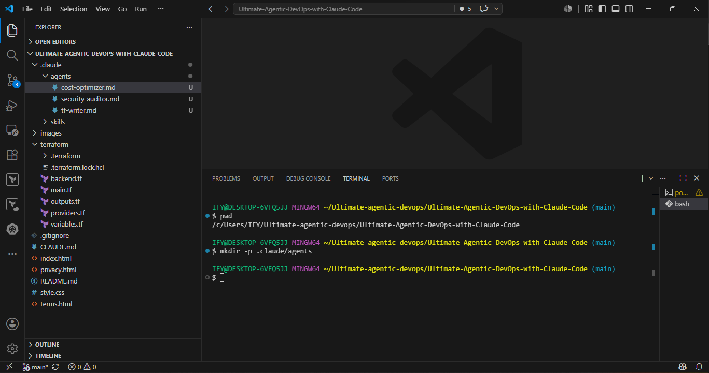
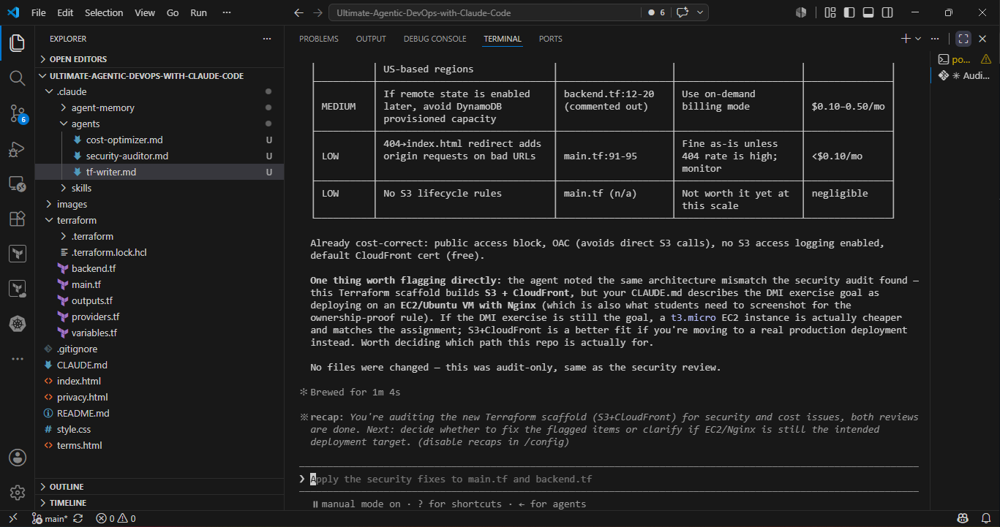

# Assignment 4 — Building Your AI Team

Part of the DevOps Micro Internship (DMI) Cohort 3 with Agentic AI

---

## Purpose

In this assignment, you will build and configure a set of specialized AI subagents inside your project. You will learn how different models and tool permissions define agent behavior, and you will trigger two real agent delegations to analyze security and cost aspects of your Terraform infrastructure.

---

# Task 1 — Create the Agents Folder and Add Files

## Goal

Create the `.claude/agents/` directory and add all required agent files.

### Evidence

#### Screenshot 1 — VS Code sidebar showing `.claude/agents/` with all 3 files

# Task 2 — Compare the Agent Configurations

## Goal

Analyze the configuration differences between the three agents and demonstrate understanding of model and tool selection.

### Written Answers

#### 1. Why does the cost optimizer use Haiku instead of Sonnet?
Haiku's the right pick here because cost optimization doesn't need heavy thinking. You're scanning for expensive API calls, checking configs against a checklist, flagging wasted resources. That's pattern matching work. Haiku's fast enough and cheap enough for this job. Sonnet would be overkill and cost way more per token for no real benefit.

#### 2. Why does the security auditor NOT have Write in its tools list?

A security auditor's job is to find problems and report them, not fix them. If you give it Write access, you're breaking its own purpose. Plus it's risky. If anything compromises that agent, you don't want it able to touch your infrastructure. Better to leave it read-only. It can still do its job: read code, check configs, flag issues. The agent doesn't need to write anything to do that.

#### 3. Why does the tf-writer use `inherit` instead of a specific model?

inherit lets the tf-writer use whatever model the main conversation is running. That's more flexible than hardcoding a model. Claude Code checks the CLAUDE_CODE_SUBAGENT_MODEL environment variable, so you can swap models on each call without redefining the agent every time. It's just cleaner that way.

### Evidence

#### Screenshot 2 — `security-auditor.md` frontmatter showing model and tools configuration

![alt text]

#### Screenshot 3 — `cost-optimizer.md` frontmatter showing the model and tools configuration

![alt text]

# Task 3 — Run the Security Auditor

## Goal

Trigger the security auditor agent and analyze the generated security report for your Terraform infrastructure.

### Evidence

#### Screenshot 4 — The delegation message showing Claude launched the security-auditor

![alt text]

#### Screenshot 5 — Security audit report output

![alt text]

# Task 4 — Run the Cost Optimizer

## Goal

Trigger the cost optimizer agent and review the generated cost optimization report.

### Evidence

#### Screenshot 6 — The full cost optimization report

[alt te!xt](screenshots/tf-review-for-cost-opt.png)

# Submission Instructions

- Ensure all agent files are committed in `.claude/agents/`
- Complete all written answers in your GitHub Repo
- Push final changes to your forked GitHub repository

## GitHub Repository URL

https://github.com/BlessingBrenda/devops-micro-internship-pravinmishra.git

# Completion Checklist

- [ ] `.claude/agents/` folder contains all 3 agent files
- [ ] Screenshot 2 shows correct `security-auditor.md` configuration
- [ ] Screenshot 3 shows correct `cost-optimizer.md` configuration
- [ ] All 3 written answers completed 
- [ ] Security auditor executed successfully
- [ ] Cost optimizer executed successfully
- [ ] Security report is visible with findings
- [ ] Cost report is visible with recommendations
- [ ] All required screenshots added
- [ ] GitHub repo updated with agents

---

## 📌 About DMI & CloudAdvisory

DevOps Micro Internship (DMI) is a project-based DevOps program run by Pravin Mishra (The CloudAdvisory) focused on real-world execution, systems thinking, and career readiness.

It helps learners build strong DevOps foundations with hands-on experience.

---

## 📌 Resources

- 🌐 DMI Official Website: https://dmi.pravinmishra.com?utm_source=github&utm_medium=readme  
- 🎓 University: https://university.pravinmishra.com?utm_source=github&utm_medium=readme  
- 💬 Discord Community: https://discord.pravinmishra.com?utm_source=github&utm_medium=readme  
- 📝 Blog: https://dmi.pravinmishra.com/blog?utm_source=github&utm_medium=readme  
- ▶️ YouTube Playlist: https://www.youtube.com/playlist?list=PLFeSNDtI4Cho  
- 🔗 Pravin Mishra (LinkedIn): https://www.linkedin.com/in/pravin-mishra-aws-trainer/  
- 🏢 CloudAdvisory (LinkedIn): https://www.linkedin.com/company/thecloudadvisory/

---

*This submission is part of DevOps Micro Internship (DMI) Cohort 3 — Agentic AI Track.*