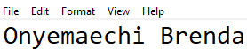

# Assignment 1 — AWS Free Tier Account Setup (EpicReads Cloud Onboarding)

Part of the DevOps Micro Internship (DMI) Cohort 3 with Agentic AI

---

## Purpose

In this assignment, you will create and verify an AWS Free Tier account as part of onboarding EpicReads — an online bookstore moving to the cloud. You will demonstrate an understanding of AWS fundamentals, Free Tier services, and account setup by answering conceptual questions and capturing proof of a working AWS Console login.

---

# Task 1 — Understanding AWS & Free Tier

## Goal

Demonstrate understanding of AWS basics and Free Tier usage by answering the following questions in your own words (3–4 lines each).

### Answers

#### Question 1 — What is an AWS account, and why do you need it at this stage?

 AWS account is my login and billing identity on Amazon's cloud platform. It's what lets me actually spin up services like EC2 servers or S3 buckets instead of just reading about how An they work. Since EpicReads is moving to the cloud, I need this account to move past tutorials and get hands-on in the same environment a real DevOps engineer would use. It's the foundation before I can build or test anything for the migration.

---

#### Question 2 — What is AWS Free Tier, and how long does it last?
AWS Free Tier lets users explore and experiment with AWS services at little or no cost, as long as usage stays within set limits. The structure actually depends on when the account was created: accounts made after July 15, 2025 get a $200 credit that lasts up to 6 months, while accounts created before that date follow the older 12-month free usage model. Either way, it gives beginners like me room to build and test things without worrying about unexpected billing.

---

#### Question 3 — Name three AWS Free Tier services and their free usage limits.
EC2: 750 hours/month of a t2.micro/t3.micro instance, enough to run one small server continuously, useful for testing EpicReads' backend.
S3: 5GB of standard storage plus 20,000 GET and 2,000 PUT requests/month, good for storing static assets like book cover images.
DynamoDB: part of AWS's "Always Free" tier, offering 25GB of storage plus 25 provisioned read/write capacity units/month, which never expires regardless of when the account was created.

---

# Task 2 — Create AWS Free Tier Account

## Goal

Create a valid AWS Free Tier account and sign in to the AWS Management Console.

> No screenshots required for this task. Completion is verified through Task 3.

---

# Task 3 — Verify AWS Account

## Goal

Confirm that your AWS account setup is complete by navigating to the Account section and capturing proof.

### Evidence

#### Screenshot 1 — AWS Account page showing account name (email may be blurred)

---

# Submission Instructions

- Add all required screenshots in your GitHub repository submission
- Full name must be visible in required screenshots
- Do not expose sensitive information (keys, passwords, account IDs)

---

# Completion Checklist

- [ ] Task 1 answers written in own words
- [ ] AWS Free Tier account created successfully
- [ ] Signed in to AWS Management Console
- [ ] Screenshot of AWS Account page captured (full name visible, no sensitive data)
- [ ] All required screenshots added to repository

---

## 📌 About DMI & CloudAdvisory

DevOps Micro Internship (DMI) is a project-based DevOps program run by Pravin Mishra (The CloudAdvisory) focused on real-world execution, systems thinking, and career readiness.

It helps learners build strong DevOps foundations with hands-on experience.

---

## 📌 Resources

- 🌐 DMI Official Website: https://dmi.pravinmishra.com?utm_source=github&utm_medium=readme  
- 🎓 University: https://university.pravinmishra.com?utm_source=github&utm_medium=readme  
- 💬 Discord Community: https://discord.pravinmishra.com?utm_source=github&utm_medium=readme  
- 📝 Blog: https://dmi.pravinmishra.com/blog?utm_source=github&utm_medium=readme  
- ▶️ YouTube Playlist: https://www.youtube.com/playlist?list=PLFeSNDtI4Cho  
- 🔗 Pravin Mishra (LinkedIn): https://www.linkedin.com/in/pravin-mishra-aws-trainer/  
- 🏢 CloudAdvisory (LinkedIn): https://www.linkedin.com/company/thecloudadvisory/

---

*This submission is part of DevOps Micro Internship (DMI) Cohort 3 — Agentic AI Track.*